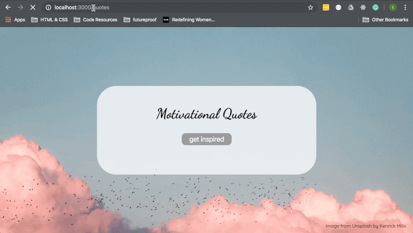

# Lap 1 Debugging Assignment

Welcome to your first debugging assignment!
This repo is riddled with bugs and we need your help to fix it up.
Please make sure that you **read all the instructions before starting**.

## Code of Conduct
- Do not ask your classmates (verbally or through any other communication method) for help.
- Do not copy/paste any code from someone else or from any online resource.

## Tasks
You are going to debug and complete a Random Quotes generator. When you are finished with the app, it should look something like this:

### Server
-[] Install the node modules and get your api server running
-[] Use the comments in `app.js` to add the missing routes and improve the `/quotes/:index` route

### Client
-[]Edit title and button using CSS and HTML so that it looks like the one in the gif (don't worry about exact colour or font size). Feel free to use external fonts.
-[]Change the background image and add image credits in the bottom right-hand corner of the page.
-[]Clean up any repetitive or unneeded code
-[]Debug script.js so that a random quote is shown every time the button is clicked

_(You may restructure / add files as you deem necessary)_

### README
- Add a useful README to document your work, take a look at [this guide](https://gist.github.com/getfutureproof-admin/dfe45adba508f931bf83d144cbbf6bbe) on assignment specific requirements.

***

## GitHub Classroom Flow
- GitHub Classroom has created this repo, your very own with your username in the title! 
- **DO NOT** fork this repo
- Clone it to your machine and get to work
- Remember to make regular commits with clear and concise messages
- Work on, and make your commits to the master branch
- Push your code back up to GitHub on the master branch (you should only need `git push`)
- **You do not need to make a PR** - GitHub Classroom has created a PR from master to feedback to help us review
- Once you have made all your final commits and pushes, request review on the 'Feedback' PR from your assigned reviewer:
  + Click on 'Pull requests' at the top of this repo
  + Click on 'Feedback', it should be the only open PR
  + On the right hand side, click the cog next to 'Reviewers' and select your assigned reviewer
- **DO NOT** merge or close the PR

***

# Enjoy! 😁
